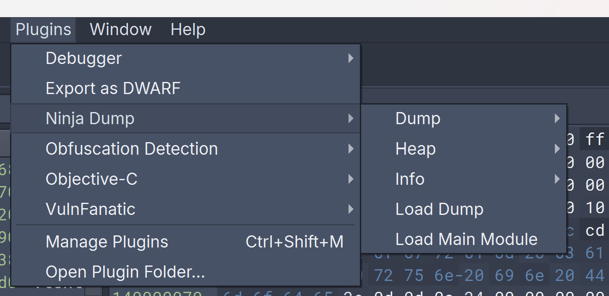
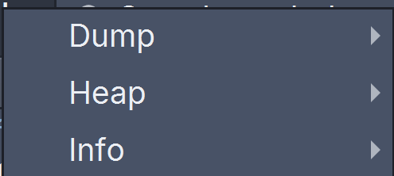
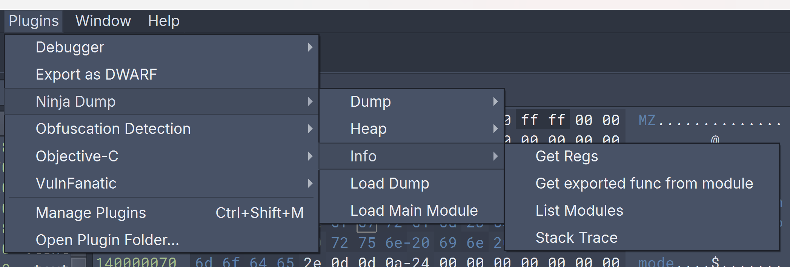
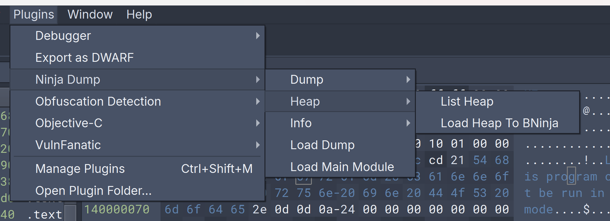
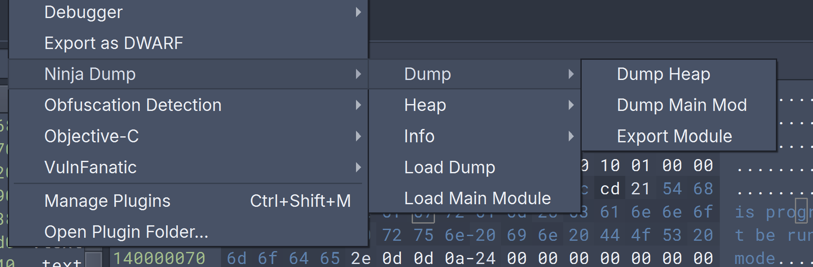

# NinjaDump 🥷💾

NinjaDump is a powerful plugin designed for Binary Ninja, tailored to enhance your analysis and extraction of information from dump files, be it Full dumps or minidumps.

## Dive into the Dump 🕵️‍♂️🗂️

Within the plugin, a plethora of options await to explore the depths of the dump:

### Load Your Dump 📂🔍
- **Load Dump**: Load your dumped image effortlessly, which will be seamlessly integrated into our plugin for further operations.
- **Load Main Module**: Initialize the main module of the dumped file into the Binary Ninja engine, setting the stage for advanced analysis.

## Tools at Your Fingertips 🛠️

NinjaDump is not just a utility—it's a suite. Spread across three primary tools with their respective sub-activities, they serve as your gateway to the internals of the dump file.

### 3 Primary Functions:

#### Info 🔍
- **Get Regs**: Capture the last-known state of the registers at the dump's snapshot.
- **List Modules**: Enumerate all modules loaded by the dumped process.
- **Stack Trace**: Trace the program's execution flow from the dump, giving you a mini-map of the stack's journey.

#### Heap 🧱
- **List Heap**: Enumerate memory regions allocated by the process.
- **Load Heap to BNinja**: Select and load memory regions directly into Binary Ninja for in-depth analysis.

#### Dump 💾
- **Dump Heap**: Extract and save heap information to your disk.
- **Dump Main Mod**: Isolate and extract the main module from the dump.
- **Export Module**: Export specific modules from the dump for external scrutiny.

## In-Depth Features:

### Info - The Intelligence Gatherer 🕵️‍♂️

Access crucial information from the dump file, including:
- The snapshot of the register states at the moment of the crash.
- A complete listing of all the modules loaded by the process at the time of dumping.
- A concise and insightful mini-stack trace to navigate through the program's execution path.

### Heap - The Memory Maestro 🧠

With Heap tools, gain insights into:
- The memory allocation landscape of the process.
- The ability to cherry-pick and dissect memory regions within Binary Ninja.

### Dump - The Extraction Expert 🏗️

Deploy Dump tools to:
- Carve out information residing in the dump and preserve it on your disk, ready for further exploration.

---

Embark on your NinjaDump journey now and turn the daunting task of dump analysis into an adventure of discovery! 🚀👨‍💻

---
